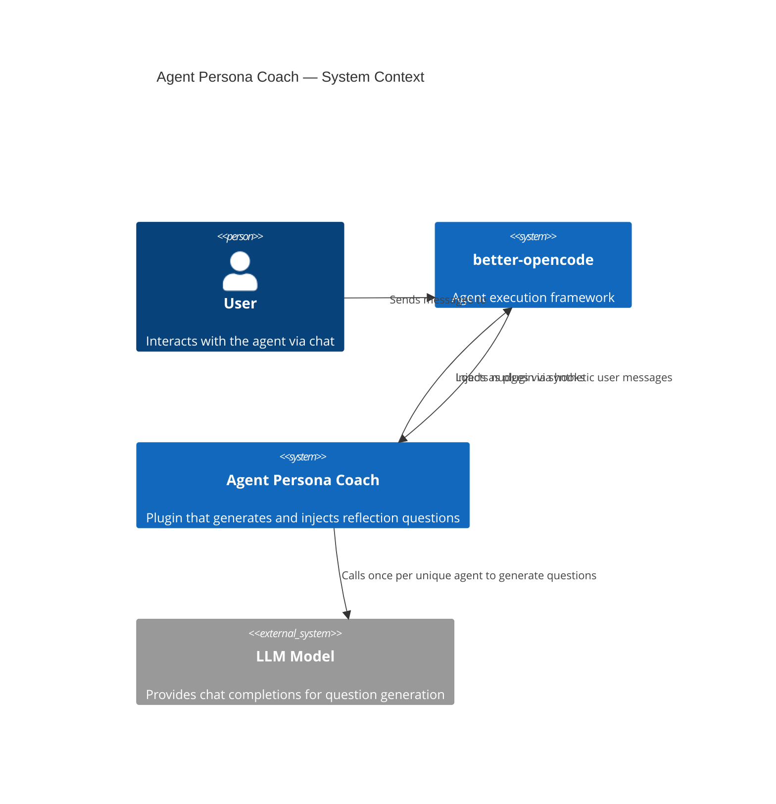

# System Context: Agent Persona Coach

## Diagram

## Elements

| ID | Name | Type | Description |
|----|------|------|-------------|
| `user` | User | Person | End user interacting with the agent |
| `opencode` | better-opencode | System | Agent execution framework that loads plugins |
| `plugin` | Agent Persona Coach | System | Plugin generating and injecting reflection questions |
| `model` | LLM Model | System_Ext | External model used for one-time question generation |

## Notes

The plugin integrates with better-opencode via 3 hooks: `chat.message` (session init + traversal reset), `tool.execute.before` (rule compliance), and `tool.execute.after` (cadence nudges + traversal observation). The LLM is only called once per unique agent persona (cached), making it a low-cost dependency. Nudges are delivered exclusively via `output.inject` (synthetic user messages) — the `system.transform` path was removed to preserve Anthropic's prompt cache per [[adrs/0004-remove-system-prompt-injection.adr.md]]. Since ADR-0009 the rules nudge also flows through `tool.execute.after`; ADR-0010 adds an opt-in deterministic `TraversalNudgeEngine` fed from `onToolAfter`.
