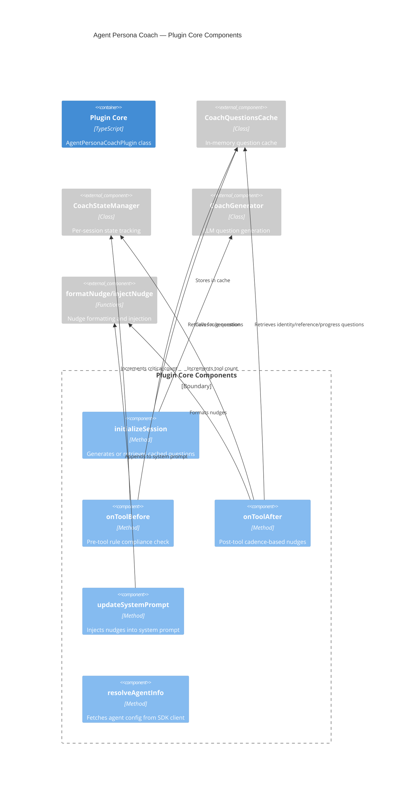

# Component: Agent Persona Coach — Internal Components

## Diagram

## Elements

| ID | Name | Type | Technology | Description |
|----|------|------|-----------|-------------|
| `initialize` | initializeSession | Component | TypeScript | Called at session start; triggers generation or cache retrieval |
| `onToolBefore` | onToolBefore | Component | TypeScript | Called before critical tools; increments critical count, checks cadence |
| `onToolAfter` | onToolAfter | Component | TypeScript | Called after each tool; increments tool count, checks all cadence categories |
| `updateSystemPrompt` | updateSystemPrompt | Component | TypeScript | Injects accumulated nudges into the last system prompt element |
| `resolveAgentInfo` | resolveAgentInfo | Component | TypeScript | Fetches full agent config from SDK client when agentInfo is empty |

## Notes

`onToolAfter` accumulates all matching nudges (not just the first) — this was a fix for the priority collision issue where identity checks were blocking progress checks. The `resolveAgentInfo` method handles both V1 (`prompt` field) and V2 (`system` field) agent info formats.
