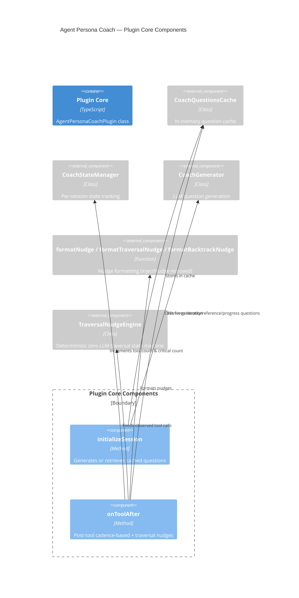

# Component: Agent Persona Coach — Internal Components

## Diagram

## Elements

| ID | Name | Type | Technology | Description |
|----|------|------|-----------|-------------|
| `initialize` | initializeSession | Component | TypeScript | Called at session start; triggers generation or cache retrieval |
| `onToolAfter` | onToolAfter | Component | TypeScript | Called after each tool; increments tool count, checks all cadence categories, feeds traversal engine |
| `traversal` | TraversalNudgeEngine | Component_Ext | TypeScript | Deterministic zero-LLM state machine anchoring decision-tree nodes and emitting traversal/backtrack nudges |

## Removed Components

The following components were removed per [[adrs/0004-remove-system-prompt-injection.adr.md]] and [[adrs/0009-move-rules-nudge-to-ontoolafter.adr.md]]:

- **`onToolBefore`** — Pre-tool rule compliance check. Removed per ADR-0009; rules nudge logic moved to `onToolAfter`.
- **`updateSystemPrompt`** — Injected accumulated nudges into the last system prompt element. Dead code after system.transform removal.
- **`resolveAgentInfo`** — Fetched full agent config from SDK client when agentInfo was empty. Dead code; removed.
- **`buildIdentityNudge`** — Built identity nudge on demand using cached questions; used by server for per-user-message injection via system.transform. Dead code; removed.

## Notes

`onToolAfter` accumulates all matching nudges (not just the first) — this was a fix for the priority collision issue where identity checks were blocking progress checks. The `resolveAgentInfo` method was removed along with the system.transform path. The `buildIdentityNudge` method was a focused public API that allowed the server hook to format identity nudges without exposing internal `buildNudge` implementation details; it is no longer needed because initialization is now handled in `chat.message` per [[adrs/0005-move-lazy-init-to-chat-message.adr.md]].

**Traversal engine (per [[adrs/0010-traversal-nudge.adr.md]]):** `TraversalNudgeEngine` (`src/traversal.ts`) is a deterministic, zero-LLM state machine. `onToolAfter` feeds it observed tool calls (`observeTool`); traversal tools anchor nodes and reset counters, non-traversal calls accrue toward the nudge cadence. Nudges are formatted by `formatTraversalNudge`/`formatBacktrackNudge` (`src/injector.ts`) and delivered via `output.inject`. A new `chat.message` resets traversal state via `resetTraversal`.

**Config-driven prompts (per [[adrs/0006-config-driven-prompts.adr.md]]):** The `initializeSession` method now forwards `this.config.coachPrompt` through the call chain: `initializeSession` → `cache.getOrGenerate(agentName, personaText, modelOverride, promptTemplate, generate)` → `generator.generate(agentName, personaText, promptTemplate, modelOverride)` → `buildCoachPrompt(personaText, promptTemplate)`. The prompt template flows alongside persona text through the cache/generator chain. This is an additive change — the component relationships remain the same; only the method signatures accept an additional `promptTemplate` parameter.
