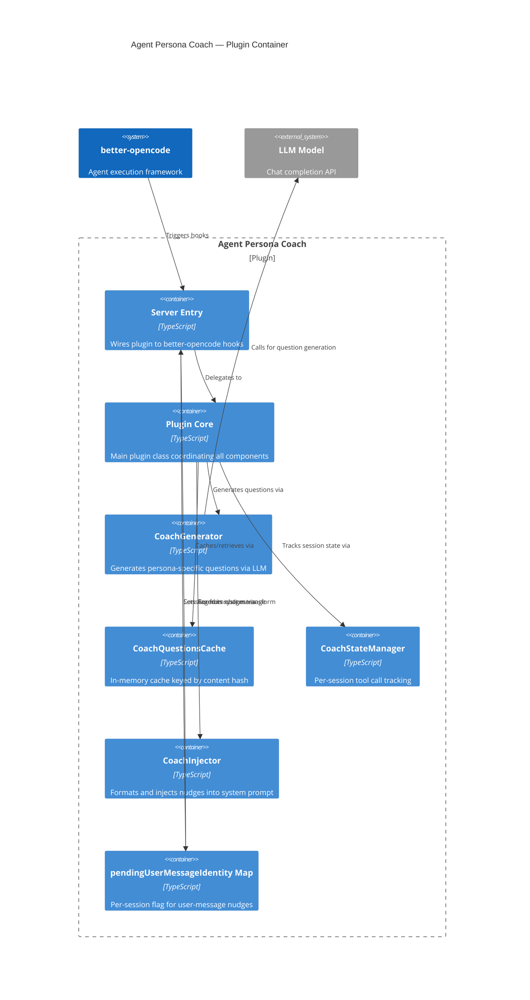

# Container: Agent Persona Coach — Plugin Container

## Diagram

## Elements

| ID | Name | Type | Technology | Description |
|----|------|------|-----------|-------------|
| `server` | Server Entry | Container | TypeScript | `server.ts` — wires plugin to better-opencode hooks |
| `core` | Plugin Core | Container | TypeScript | `index.ts` — `AgentPersonaCoachPlugin` class coordinating all components |
| `generator` | CoachGenerator | Container | TypeScript | `generator.ts` — LLM call, JSON parsing, validation, fallback |
| `cache` | CoachQuestionsCache | Container | TypeScript | `cache.ts` — in-memory Map keyed by `agentName:SHA-256(personaText)` |
| `state` | CoachStateManager | Container | TypeScript | `state.ts` — per-session tool call and critical tool call counters |
| `injector` | CoachInjector | Container | TypeScript | `injector.ts` — `formatNudge()` and `injectNudge()` utilities |
| `flag` | `pendingUserMessageIdentity` Map | Container | TypeScript | `server.ts` — per-session boolean flag bridging `chat.message` to `system.transform` |

## Notes

All containers run in the same Node.js process (this is a plugin, not a distributed system). The cache is in-memory only — no external database. The generator calls the LLM synchronously during `initializeSession()` and caches the result.
