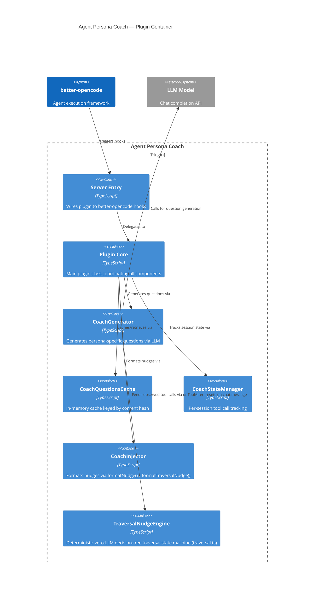

# Container: Agent Persona Coach — Plugin Container

## Diagram

## Elements

| ID | Name | Type | Technology | Description |
|----|------|------|-----------|-------------|
| `server` | Server Entry | Container | TypeScript | `server.ts` — wires plugin to better-opencode hooks (chat.message, tool.execute.before, tool.execute.after) |
| `core` | Plugin Core | Container | TypeScript | `index.ts` — `AgentPersonaCoachPlugin` class coordinating all components |
| `generator` | CoachGenerator | Container | TypeScript | `generator.ts` — LLM call, JSON parsing, validation, fallback |
| `cache` | CoachQuestionsCache | Container | TypeScript | `cache.ts` — in-memory Map keyed by `agentName:SHA-256(personaText)` |
| `state` | CoachStateManager | Container | TypeScript | `state.ts` — per-session tool call and critical tool call counters |
| `injector` | CoachInjector | Container | TypeScript | `injector.ts` — `formatNudge()`, `formatTraversalNudge()`, `formatBacktrackNudge()` (injectNudge removed with system.transform path) |
| `traversal` | TraversalNudgeEngine | Container | TypeScript | `traversal.ts` — deterministic zero-LLM state machine: observes tool calls per session, anchors decision-tree nodes, emits traversal/backtrack nudges |

## Removed Containers

The following containers were removed per [[adrs/0004-remove-system-prompt-injection.adr.md]]:

- **`pendingUserMessageIdentity` Map** — Per-session flag bridging `chat.message` to `system.transform`. Removed because the system.transform path was eliminated.
- **`injectNudge()`** — Function in `injector.ts` that appended a nudge into the system prompt text. Dead code after system.transform removal.

## Notes

All containers run in the same Node.js process (this is a plugin, not a distributed system). The cache is in-memory only — no external database. The generator calls the LLM synchronously during `initializeSession()` and caches the result. The plugin now uses 3 hooks (was 4) — `system.transform` was removed, initialization moved to `chat.message` per [[adrs/0005-move-lazy-init-to-chat-message.adr.md]], and the deterministic `TraversalNudgeEngine` ([[adrs/0010-traversal-nudge.adr.md]]) was added as an opt-in, zero-LLM container fed from `onToolAfter` and reset on `chat.message`.
